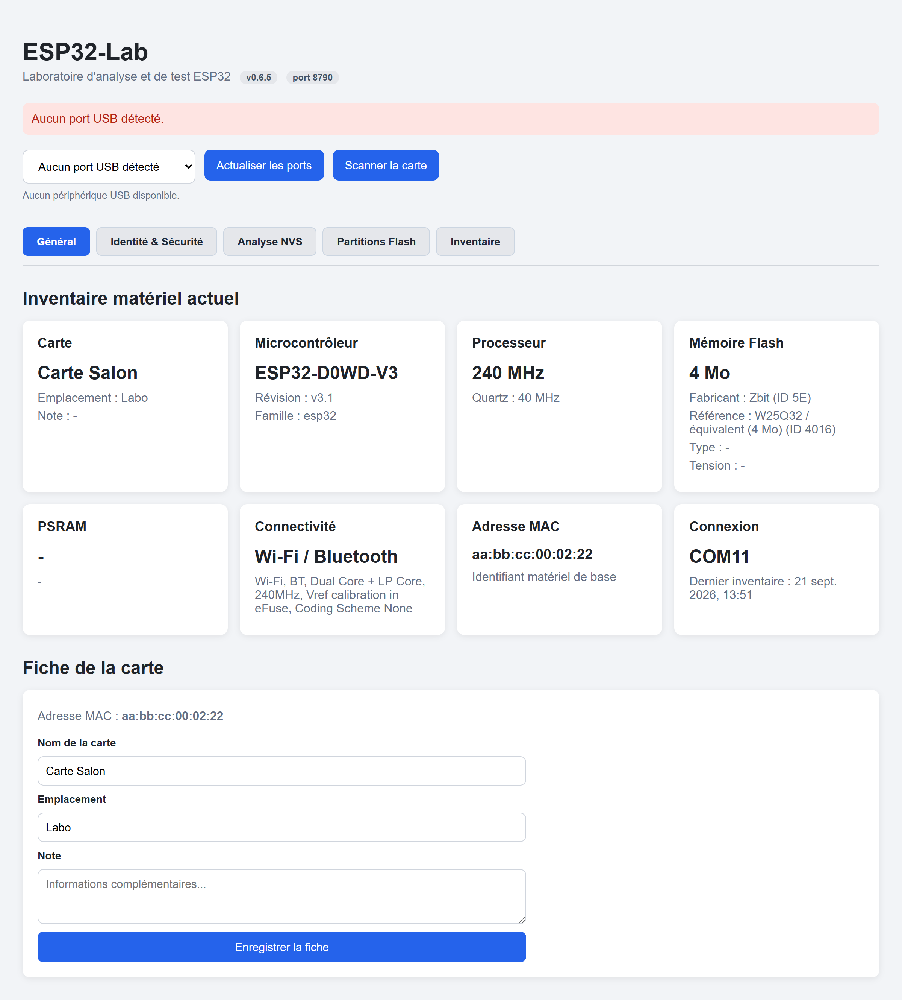
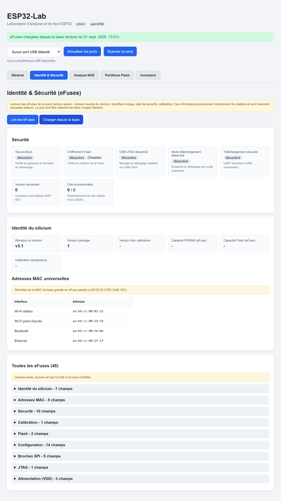
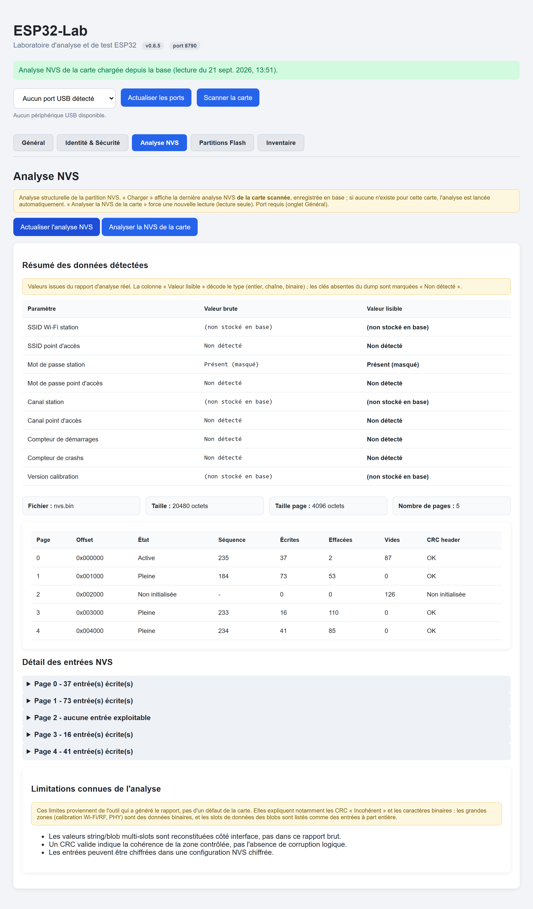
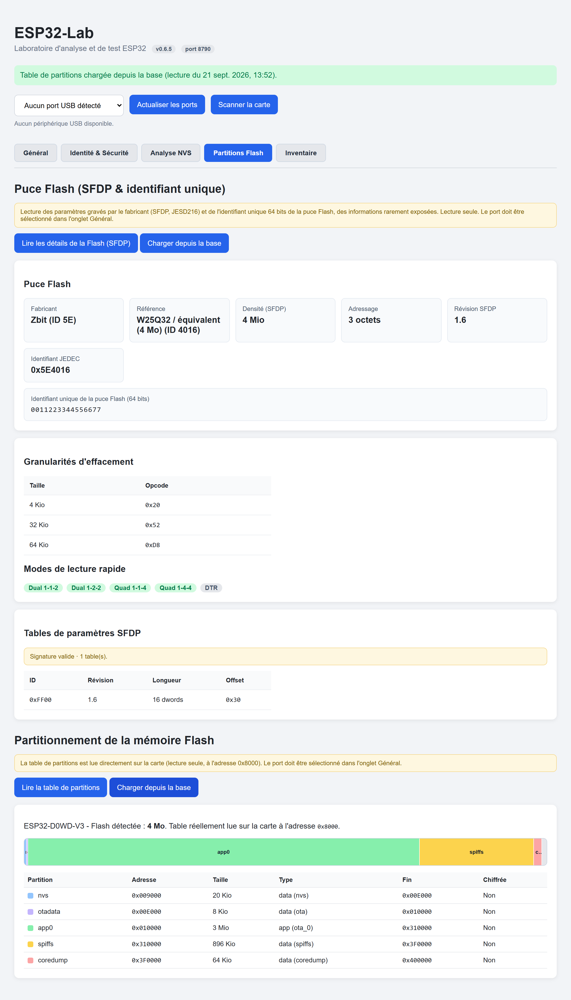
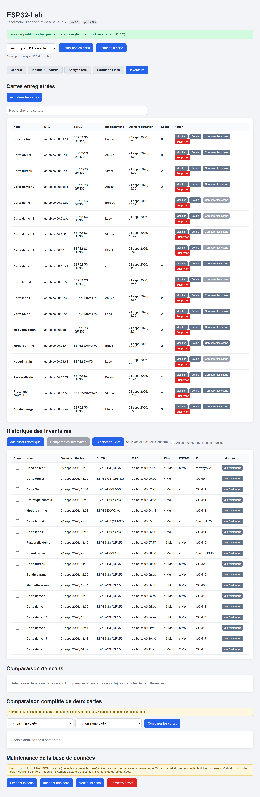

# Guide de l'interface

L'interface s'organise autour d'une **barre d'outils globale** (toujours
visible) et de **cinq onglets** : Général · Identité & Sécurité · Analyse NVS ·
Partitions Flash · Inventaire.

> Les captures d'écran de ce guide utilisent un **jeu de démonstration
> anonymisé** (noms, adresses MAC et identifiants fictifs).

## La barre d'outils (toujours visible)

En haut de la page, quel que soit l'onglet :

- **Menu des ports** - sélectionne la carte à interroger.
- **Actualiser les ports** - relance la détection des ports USB.
- **Scanner la carte** - interroge la carte sélectionnée et met à jour tout.
- **Bandeau de statut** - messages de succès (vert) ou d'erreur (rouge).

## Onglet Général

C'est la vue d'ensemble de la carte actuellement connectée.

### Inventaire matériel actuel
Des cartes résument le microcontrôleur, la Flash, la PSRAM, la connectivité et
la connexion. Les données proviennent du **dernier scan** (`Scanner la carte`).

### Fiche de la carte
Associe des informations **personnelles** à la carte (identifiée par sa MAC) :

- **Nom** (ex. « ESP32-S3 capteur météo ») ;
- **Emplacement** (ex. « Atelier ») ;
- **Note** libre.

Clique sur **Enregistrer la fiche** pour sauvegarder. Ces informations sont
conservées même après un redémarrage.

## Onglet Identité & Sécurité (eFuses)

Les **eFuses** sont des fusibles programmables une seule fois, gravés dans le
silicium. Ils contiennent les informations les plus profondes de la puce,
rarement visibles ailleurs. La lecture est **en lecture seule** : aucune eFuse
n'est modifiée.

Deux boutons :

- **Lire les eFuses** (le port doit être sélectionné dans Général) : lecture sur
  la carte, une dizaine de secondes.
- **Charger depuis la base** : réaffiche la **dernière lecture enregistrée** de
  cette carte, **sans la carte branchée** (pratique après un changement de
  poste).

S'affichent :

### Sécurité
Un tableau de bord de l'état de sécurité, avec un badge Activé/Désactivé :

- **Secure Boot** - vérification de signature du firmware au démarrage ;
- **Chiffrement Flash** - chiffrement du contenu de la Flash ;
- **USB-JTAG désactivé** - blocage du débogage matériel ;
- **Mode téléchargement désactivé** - blocage du reflashage ;
- **Téléchargement sécurisé** ;
- **Version sécurisée** - compteur anti-rollback ;
- **Clés provisionnées** - emplacements de clés utilisés.

### Identité du silicium
Révision exacte, version de package, capacités PSRAM/Flash gravées, calibration
de température, et surtout l'**identifiant unique 128 bits** de la puce.

### Adresses MAC universelles
Les quatre adresses dérivées de la MAC de base : Wi-Fi station, Wi-Fi point
d'accès, Bluetooth et Ethernet.

### Toutes les eFuses
Le dump complet (plus de 100 champs), regroupé par catégorie en sections
repliables, avec pour chaque eFuse sa valeur lisible, sa description et sa
valeur brute.

## Onglet Analyse NVS

La **NVS** est un petit espace mémoire où l'ESP32 range des réglages
(identifiants Wi-Fi, compteurs de démarrage, calibration…).

Deux boutons :

- **Charger l'analyse NVS** - affiche la dernière analyse NVS **de la carte
  scannée** (récupérée en base par son adresse MAC) ; si aucune n'existe pour
  cette carte, l'analyse est **déclenchée automatiquement** en lisant la carte.
- **Analyser la NVS de la carte** - force une nouvelle lecture de la partition
  NVS (lecture seule) et régénère le rapport.

L'analyse affiche :

- un **Résumé des données détectées** avec trois colonnes :
  - *Paramètre* (ex. « Compteur de démarrages ») ;
  - *Valeur brute* (les octets tels que stockés) ;
  - *Valeur lisible* (décodée : `41`, `640`, `chaîne (36 octets)`…) ;
- des informations sur le fichier analysé et ses pages ;
- le **détail des entrées** (repliable), avec la valeur lisible de chacune.

> 🔒 **Secrets non stockés.** Pour ne jamais conserver de secret (ni de copie
> résiduelle), ESP32-Lab n'enregistre **aucun octet brut NVS** en base : seule
> la structure est gardée. Quand tu **charges depuis la base**, les valeurs
> décodées (SSID, canal…) apparaissent donc « (non stocké en base) », et les
> mots de passe « Présent (masqué) ». Une **lecture live** sur la carte
> (« Analyser la NVS de la carte ») affiche, elle, toutes les valeurs décodées.

## Onglet Partitions Flash

Cet onglet regroupe deux lectures **réelles** de la puce Flash (lecture seule).

### Puce Flash (SFDP & identifiant unique)
Clique sur **Lire les détails de la Flash (SFDP)**. Le SFDP (JESD216) est une
table gravée par le fabricant décrivant la puce :

- fabricant et référence (identifiant JEDEC) ;
- **densité réelle**, adressage (3 ou 4 octets) ;
- **granularités d'effacement** disponibles (4/32/64 Kio) avec leurs opcodes ;
- **modes de lecture rapide** supportés (dual, quad, DTR) ;
- les tables de paramètres SFDP ;
- l'**identifiant unique 64 bits** propre à cette puce Flash.

### Partitionnement de la mémoire Flash

La Flash est découpée en **partitions** (application, données, système de
fichiers…). Cette section lit **réellement** cette organisation sur la carte.

1. Sélectionne le port (onglet Général).
2. Clique sur **Lire la table de partitions**.

> Comme pour les eFuses, un bouton **Charger depuis la base** réaffiche la
> dernière lecture SFDP et la dernière table de partitions enregistrées, **sans
> la carte branchée**.

La lecture (en **lecture seule**, à l'adresse `0x8000`) affiche :

- une **barre colorée** proportionnelle à la taille de chaque partition ;
- un **tableau** : nom, adresse, taille, type, fin, et si la partition est
  chiffrée.

> La lecture redémarre brièvement la carte (comportement normal d'esptool).

## Onglet Inventaire

Regroupe tout l'historique de tes cartes, en trois sections.

### 1. Cartes enregistrées
Le **registre** de toutes les cartes déjà vues. Colonnes : nom, MAC, modèle,
emplacement, dernière détection, **nombre de scans**, et actions :

- **Modifier** - édite la fiche de la carte.
- **Détails** - ouvre une fenêtre avec toutes les caractéristiques connues.
- **Comparer les scans** - compare deux scans de **cette même carte** (actif
  seulement à partir de 2 scans).
- **Supprimer** - retire **définitivement** la carte et toutes ses lectures de
  la base (une confirmation est demandée).

Un champ de recherche filtre la liste.

### 2. Historique des inventaires
Tous les scans réalisés, la dernière détection par carte. Ici tu peux :

- **cocher deux scans** puis **Comparer les inventaires** ;
- **Exporter en CSV** l'historique complet ;
- afficher **uniquement les différences** dans la comparaison.

### 3. Comparaison de scans
Affiche le résultat côte à côte de deux scans : chaque caractéristique est
marquée **Identique** (vert) ou **Différent** (rouge). Pratique pour repérer un
changement de mémoire, de firmware détecté, etc.

### 4. Comparaison complète de deux cartes
Choisis **deux cartes différentes** dans les listes déroulantes puis
**Comparer les cartes**. ESP32-Lab confronte toutes les données enregistrées en
base (identification, eFuses/sécurité, SFDP, partitions), groupe par groupe.
Des badges indiquent quelles sections ont déjà été capturées pour chaque carte
(scanne et lis les eFuses/SFDP/partitions/NVS d'une carte pour enrichir la
comparaison).

### 5. Maintenance de la base de données
Quatre outils :

- **Exporter la base** - télécharge un fichier JSON portable contenant toutes
  les cartes et toutes les lectures. Idéal pour sauvegarder ou **changer de
  poste** (l'échange fonctionne y compris entre Windows et Raspberry Pi).
- **Importer une base** - fusionne un export dans la base actuelle, sans
  doublon ni écrasement des noms. Le résultat s'affiche dans la section.
- **Vérifier la base** - contrôle d'intégrité + statistiques (nombre de cartes,
  de lectures, taille du fichier).
- **Remettre à zéro** - efface **définitivement** toutes les données (une
  confirmation est demandée ; pense à exporter avant).

> **Changer de poste** : l'export/import **et** la copie du fichier
> `data/esp32lab.db` fonctionnent tous les deux. Aucun des deux ne contient de
> secret (mots de passe, clés) : ils ne sont **jamais stockés**, seulement une
> empreinte pour détecter un changement. Cette empreinte est calculée avec une
> **clé propre à chaque installation** (hors base) : après un transfert vers un
> autre poste, la détection de changement se rebase simplement au prochain scan.
> Rien à faire de spécial, et aucun secret ne circule.
>
> Tout le contenu des sections (identification, eFuses, SFDP, partitions,
> structure NVS) est transféré à l'identique et se réaffiche depuis la base sur
> le nouveau poste. Seuls les **octets bruts NVS** ne sont pas conservés (pour
> ne laisser passer aucun secret) : leurs valeurs décodées ne réapparaissent
> qu'en **relisant la carte**.

## Astuce

Pour comparer l'évolution d'une carte dans le temps : scanne-la aujourd'hui,
puis à nouveau plus tard, et utilise **Comparer les scans** dans l'onglet
Inventaire.

➡️ Un souci ? [Dépannage](depannage.md)
